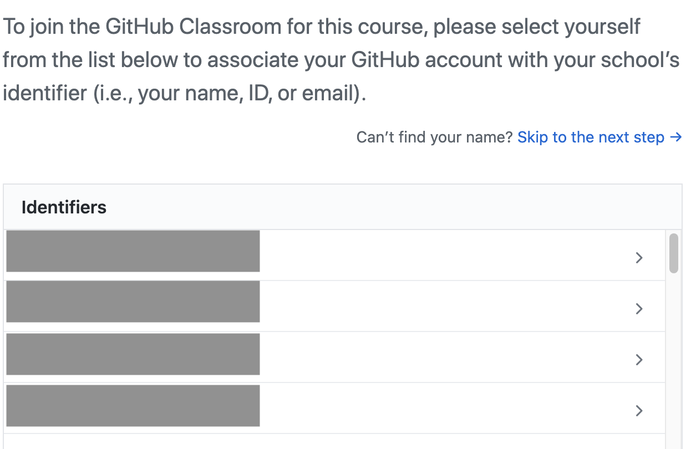
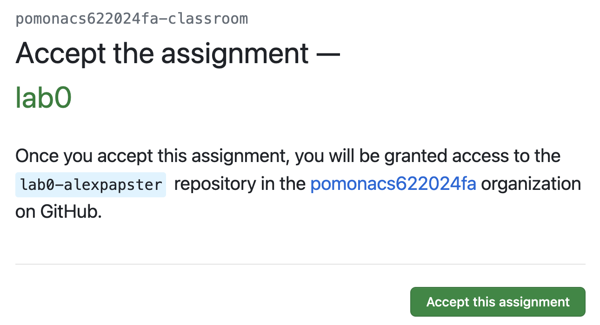
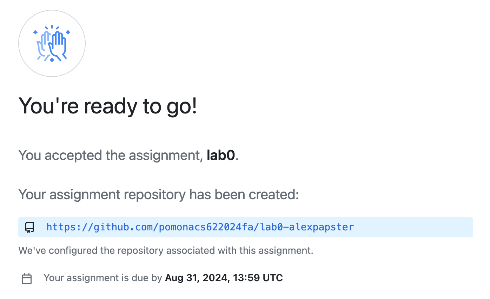
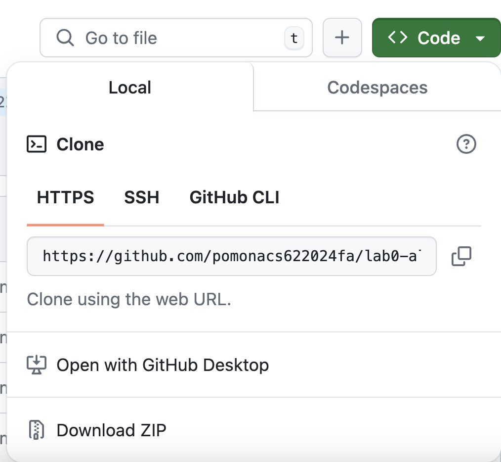
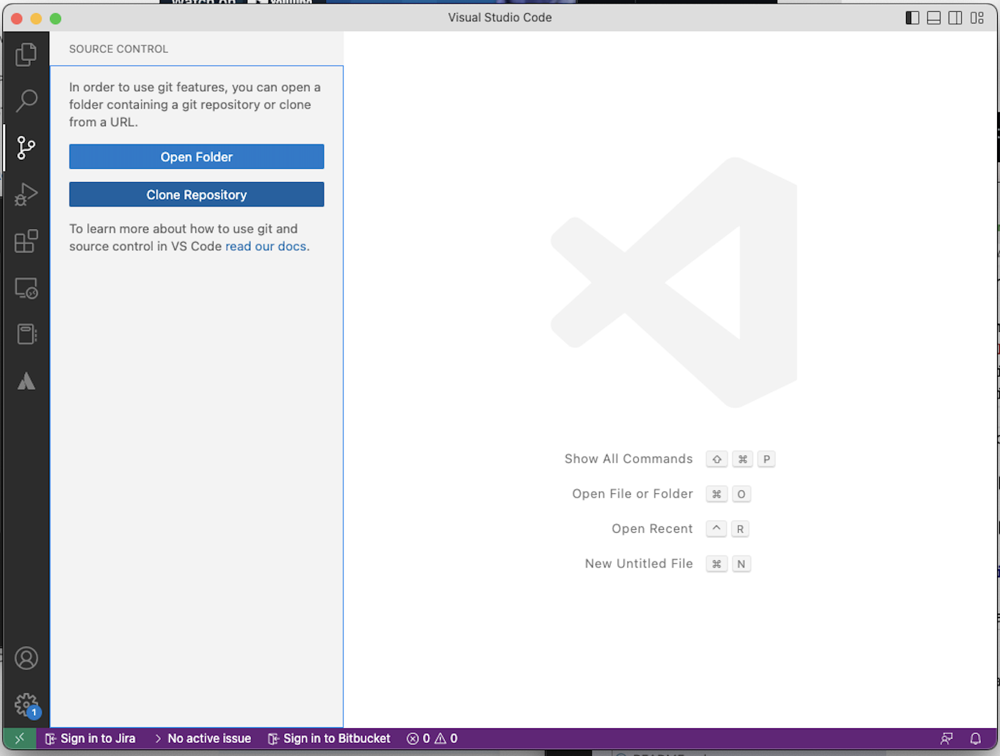
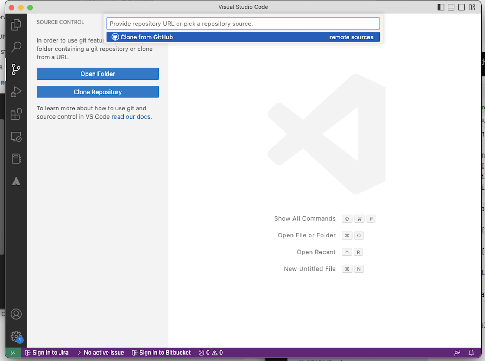
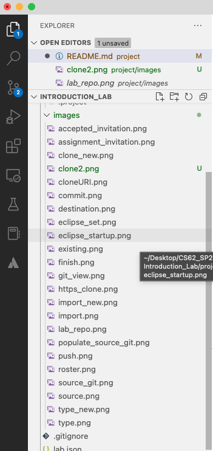
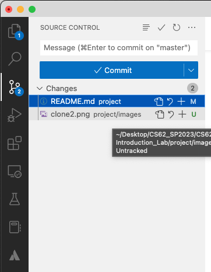
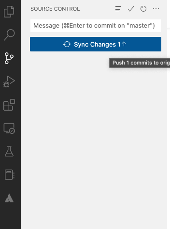
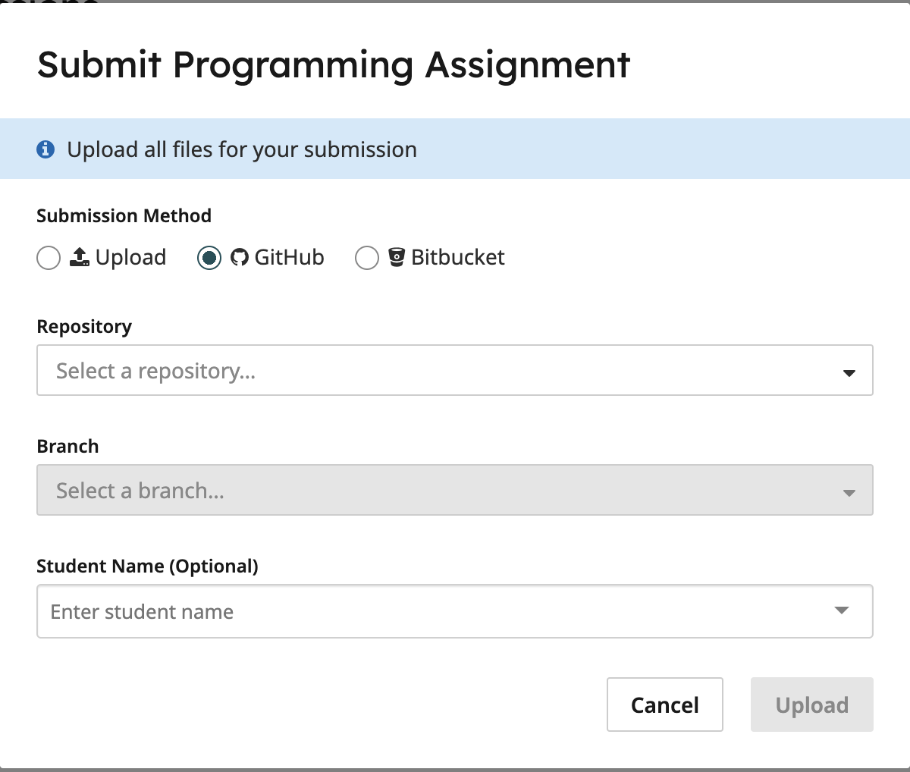

# Lab - Introduction to Java and VS Code

## Learning Goals

* Install Java and Visual Studio Code (VS Code).
* Introduction to VS Code.
* Introduction to GitHub and assignment repos.
* Building and running simple Java programs.
* Project submission through gradescope.

## Key Terms and Concepts

* `Visual Studio Code` - a code editor that includes powerful tools for editing, running, and debugging programs.
   In this course we will be using it as a Java IDE ([Integrated Development Environment](https://en.wikipedia.org/wiki/Integrated_development_environment)).
* `Git` - a distributed [version control system](https://en.wikipedia.org/wiki/Version_control)
   for tracking, coordinating, and exchanging file updates among groups of collaborating developers.
* `GitHub` - a web-based version control and collaboration platform for software
   developers, particularly popular for open-source projects and other shared code efforts.
* `Gradescope` - a web-based educational platform that we will use to submit and grade weekly assignments and labs.
   We will also use it to grade weekly quizzes and midterms/final exam.

## Getting Started

1. Confirm that you have been added to the Slack class channel and Gradescope.

2. Create a cs62 workspace.

   ***If working on your own MAC laptop***

   Open a terminal (you can type `Terminal` on `Spotlight` or `Launchpad`).  A new window
   with a shell prompt will appear.  Create a new workspace directory, by typing the following commands:

   ```bash
   cd Documents
   mkdir cs62
   cd cs62
   mkdir workspace
   ```

   Note that it doesn't have to be in your Documents folder;
   you can create cs62/workspace wherever convenient,
   but we recommend having some kind of file organization.

   ***If working on your own Windows laptop***

   Open a terminal window. A new window with a shell prompt will appear.
   Create a new workspace directory, by typing the following commands:

   ```bash
   cd Documents
   mkdir cs62
   cd cs62
   mkdir workspace
   ```

   ***If working on a school lab machine***

   Go to `Applications` and open `OneDrive`. Enter your Pomona email and password and follow all the prompts.

   Click the `Terminal` window icon on the Desktop menu bar.
   A new window with a shell prompt will appear.
   Create a new workspace directory on your desktop, by typing the following commands:

   ```bash
   cd "/Users/yourUserName/OneDrive - Pomona College/Documents/"
   mkdir cs62
   chmod 700 cs62
   cd cs62
   mkdir workspace
   ```

   Please note that `yourUserName` is your unique Pomona ID that you use to log in throughout the different IT services around the campus (e.g., `jhlp2023`).
   Note that by saving your workspace in `OneDrive`, you will be able to access it independently of the lab machine you are working on.
   The effect of these commands are:

   * We create a new directory, `cs62` for this course on your `Documents` folder **in OneDrive**.
   * We change the protection on this folder so that *only you* are able to access it
   * Within the new `cs62` folder, we create a `workspace` folder, where VS Code will store all of the information associated with your projects.

   Note that you could have achieved much of this by clicking through menus,
   but it is valuable for you to learn to work directly with the shell:
   * shell scripting is a powerful and commonly used programming language.
   * the commands available from the shell are much more powerful than those
     available with the *Finder* or other file access Graphical User Interfaces. In fact, we will dedicate a few labs on learning how to use the shell later on.

3. If you do not already have a GitHub account,
   [register a new personal user account](https://docs.github.com/en/get-started/start-your-journey/creating-an-account-on-github).

   Verify your email and follow the instructions to generate [a personal access token](https://docs.github.com/en/authentication/keeping-your-account-and-data-secure/managing-your-personal-access-tokens#creating-a-personal-access-token-classic).
   * Use the Tokens(classic) method
   * In `Note`, give your token the name `VSCode`.
   * Set `Expiration` to at least the end of the semester.
   * In Select scopes, **only click the "repo" checkbox. Make sure to click this!!!**

   Make sure you store the personal access token somewhere securely and easily accessible and treat it like a password!
   Once you exit the window, you can not retrieve the token any more. You would need to generate a new one!

4. Install the Java JDK (Temurin JDK version 25)

   * *Skip the following steps if working on lab machines but come back to them if you want to install Java and VS Code on your personal computer.*
   * Go to the [Adoptium JDK release page](https://adoptium.net/en-GB/temurin/releases)
   * Download and install the latest version for your system

5. Install VS Code

   * *Skip the following steps if working on lab machines but come back to them if you want to install Java and VS Code on your personal computer.*
   * Install VS Code by following the directions under `Installation` in these links:
      * [macOS](https://code.visualstudio.com/docs/setup/mac)
      * [Windows](https://code.visualstudio.com/docs/setup/windows)
   * Follow instructions to [install the extension pack for Java](https://code.visualstudio.com/docs/java/java-tutorial#_installing-extensions)
         - If this doesn't work, usually VSCode will pop up a suggested window in the lower right corner to install the Java pack once you have a .java file open. You may also install it through this pop-up.

6. Join the GitHub Classroom link on the course webpage.
   (I think you already have had to to be reading this file!)
   Follow that URL; you will be asked to link your GitHub account to your name.

   

   You will then see a message like:

   

   If it takes long, refresh the page (Cmd/Ctr+R). Once you accept the invitation, you will be provided with a unique URL for
   your (private) version of this project. Click it

   

   You will see a unique copy of your lab repository. Click on the green `Clone or download` button and copy the returned
   HTTPS URL:

   

7. Start VS Code on your computer

   It might ask you to choose a workspace.

   * Browse to the workspace folder you created above (it will look similar to `/Users/yourUserName/OneDrive - Pomona College/Documents/cs62/workspace`).
   * VS Code will remember this selection and prompt it as a default (or in the list of Recent Workspaces) when you start VS Code in the future.

8. Import your new GitHub repo onto the machine where you are working.

   Do the following steps (shown in screenshots below):

   * Click on `Source Control` on the left panel (3rd icon) and click on `Clone Repository` or open the Command Palette (shift+commmand+P keys) and type `>Git: Clone`.
   * Copy the link from the invitation and paste it into the `Clone URL`

   
   
   

   **Carefully** browse to the destination which needs to be your workspace that you created in `Volumes/.../yourPomonaID/Documents/cs62/workspace`.

   Once you are at the correct location, click the `Select as Repository Destination`.

   VS Code will ask if you want to open the cloned repository. Click `Open` or `Open in New Window`.

   VS Code may ask you to add your GitHub username and token we generated. Fill them in.

   If you are prompted about whether you trust the authors of this file, click Yes.

   You can always use the `Explorer` icon on the left panel (top icon, looks like two pages). Once you have cloned the repository, you can click the `Open a Java project folder` in blue.

   Open the Settings of VSCode, search for `Editor`>`Inlay Hints` and set them to Off.


## Your first coding project

We have given you a very simple starter Java file, `Employee.java` to fill in.

If your program contains any obvious syntax errors, VS Code will give you red warning indications on the relevant lines of code.
It will also highlight any "TODO" comments that you need to fill in.

To run your program, search for the `main` method in your Java class.

```java
public static void main(String args[]){
```

The Java extension should add `Run|Debug` links above the `main` method. Click the `Run` link to compile and run your program. You should see output in the Terminal portion of the VS Code window (the program does not do anything yet, so there will be no output after the command used to run the program).

## Submitting your work

*Commit* your changes and *Sync* them back to GitHub.

Git is well integrated with VS Code. Once you have made changes to the files (or added a new file), the status next to the file changes to one of: `U` (for untracked - the file is new or has been changed but has not been added to the repository yet), `M` (for modified - an existing file has been changed), or `A` (for added - this is a new file that has been added to the repository).

**Make sure to commit and push your work to GitHub MULTIPLE TIMES throughout the process!** Not only does this help us see your unique progress, but it ensures that you have frequent backups of your work. **AVOID** one big push at the end of your work. We want to be able to see the progressive development process that you followed.

To commit your changes, take the following steps:

1. Click on `Source Control` icon on the left. It should have a number in a blue circle, the number indicates the number of files that requires commit.

   

2. The left panel now shows the files that require commit. Hover next to each file name. A `+` sign should show up. Click the `+` for all files that you want to commit.

   

3. Enter a commit message in the message box to describe the changes you made, e.g., filled in the age.

4. Click `Commit` - this commits the changes to your local repository

5. Click `Sync Changes` - this pushes the changes to the main repository on the server

   

If you want to confirm that you pushed your work, go to the URL that you were given on GitHub. You should see the latest commit you pushed.

Once you are satisfied with your work and you are ready to submit it for grading, go to gradescope and use GitHub as the submission method (the repository is pomonacs622025fa/lab0-your_user_name and the branch should be `main`).

   

## Wrapping up

Each lab in this course is worth 3 points. When you're all done, make sure that you've pushed the latest version of your code to GitHub and that you have submitted your work to Gradescope, including filling out this week's [exit ticket](https://forms.gle/BVrZATFKWfXYTiKq9). Please see a TA or the professor to get checked off (they will check your Gradescope submission, and you can show them the confirmation page for the exit ticket on your computer), and then you're free to go!
